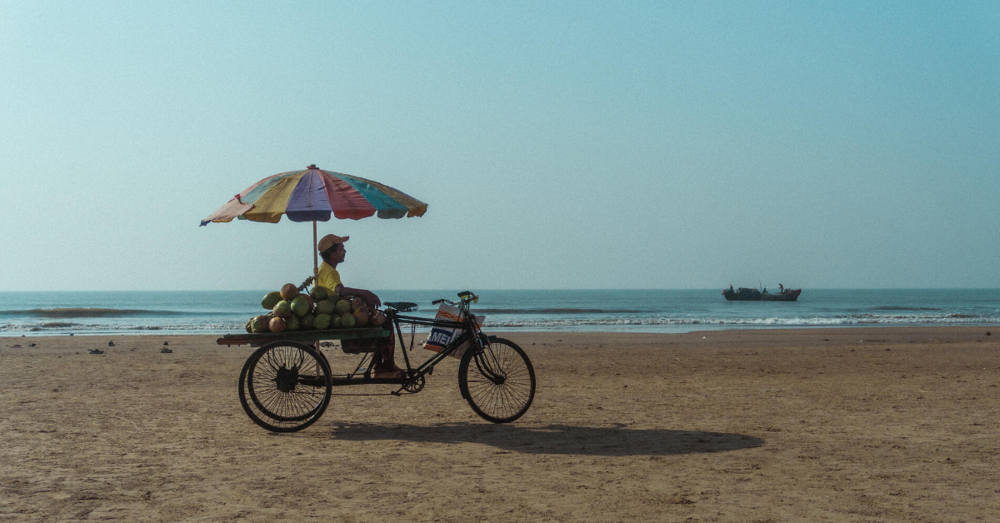

<!--
**chirag-ghosh/chirag-ghosh** is a ✨ _special_ ✨ repository because its `README.md` (this file) appears on your GitHub profile.

Here are some ideas to get you started:

- 🔭 I’m currently working on ...
- 🌱 I’m currently learning ...
- 👯 I’m looking to collaborate on ...
- 🤔 I’m looking for help with ...
- 💬 Ask me about ...
- 📫 How to reach me: ...
- 😄 Pronouns: ...
- ⚡ Fun fact: ...
-->

 
<h2>Hey! 👋</h2>

I'm Chirag Ghosh! 
- I am a software developer and photographer from India.
- I graduated from IIT Kharagpur in 2024.
- I prefer writing my own CSS rather than use some library.
- I love reading blogs, listening to music and talk about filmmaking.
- Check out my personal website to know more and connect: [www.chiragghosh.dev](https://www.chiragghosh.dev)
